# Introduction

The goal of this document is to:
* get you set up so that you can check a Leanpub course using the `didactr` package
* so I can figure out what steps are missing in this setup

## The Process

Once you have the necessary accounts set up and have gained access to the appropriate APIs, the process looks as follows:

1. Generate data frame with information about course status (`check_course()`)
2. Get PDF and PNGs from Google Slides (`create_images()`)
3. Generate videos locally from Slides and scripts (`create_videos`)
4. Upload videos to YouTube (`vids_to_youtube()`)
5. Update YouTube link in lesson (`update_youtube_link()`)

## Technology

Throughout this process, you'll get the following technologies up and running to allow you to eventually compile your Leanpub course:

* `ffmpeg` - dependency of `ari`
* Amazon Web Services (AWS) - to allow access to Polly for text-to-speech
* YouTube API - provide access to Youtube API via `tuber`
* R packages:
  * `didactr` - compile courses from Leanpub setup
    * `googledrive` - to directly access Google Slides 
    * `tuber` - to work with the YouTube API and upload videos directly
    * `ari` - to autogenerate videos from images and text

# Setup

## Install ffmpeg

While not the best long-term solution, `ffmpeg` has to be installed for use with `ari` later. Unfortunately, the autoencoder we'll need is not included with the default download. So, you'll have to install ffmpeg as below.

```{bash, eval=FALSE}
brew install ffmpeg --with-fdk-aac
```

## Amazon Web Services (AWS) :  Polly Permissions

In order to generate videos using `ari`, you'll need an Amazon Web Services (AWS) account and to give permissions to Polly from AWS.

Note on \$\$: **AWS will charge whichever account you link to your account.**


### Step 1: Get Account

Get an account at [aws.amazon.com](https://aws.amazon.com/) Click on `Sign In to the Console`.

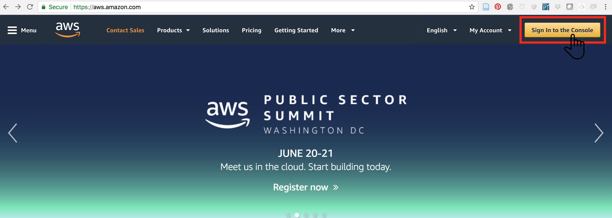
Fill in information to Create an AWS account.


Follow the prompts to enter your credit card information. 

During this process, you will be called at the number provided and asked to enter a the four-digit number displayed on your screen on your phone. 

After doing this successfully, you will be asked to select a Plan. Click `Free`.

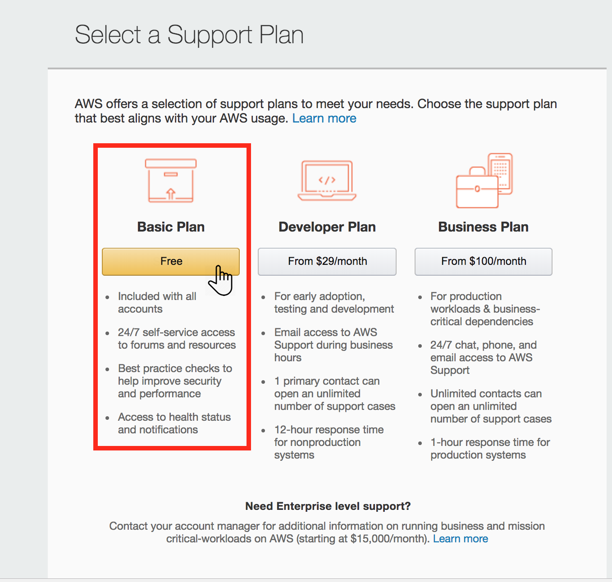

When Prompted, click `Sign in to the Console`. Follow the prompts to enter your new account information.


### Step 2: Get Credentials

On the AWS home screen, click on your username at the top right-hand side of the screen to display a drop-down menu. Click on `My Security Credentials` from this menu.

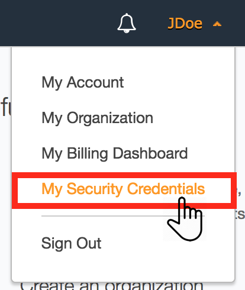


A warning screen will pop-up reminding you that these security credentials should be used with care! Read and understand this warning. Then, click on `Continue with Security Credentials`.

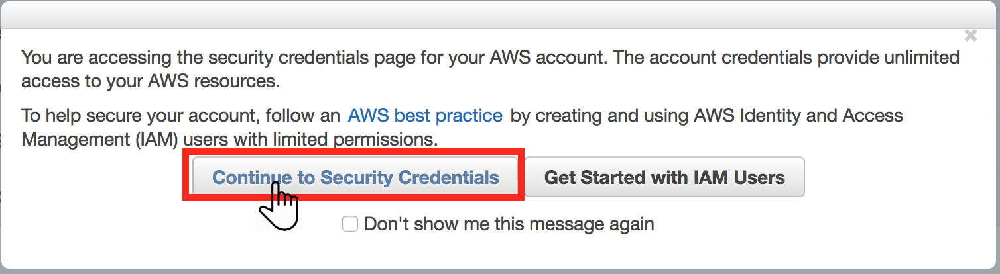


From the menu that is now available, click on "Access Keys" to expand that menu item.

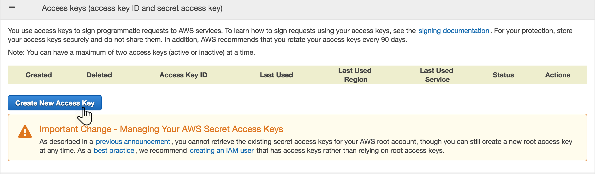

Click on `Create New Access Key`. A window will pop up letting you know that a new key has been created. You can `Download Key File` now. Yet another reminder to keep it in a safe place and never share it on the Internet.

### Step 3: Give Polly Permissions

Now that you have an access key, we have to give AWS permission to use Polly's text-to-speech capabilities. To do so, click on "Users" from the menu on the left-hand side of the screen.


If you're new to AWS, no Users will be there yet. Click on `Add User`.


Add yourself as a user and give yourself "Programmatic Access" before clicking `Next: Permissions`


Click on `Attach existing policies directly`. This will display a new searchable drop-down menu. Search "polly" in the search bar. Click on the check-box to the left of "AmazonPollyFullAccess". Scroll down and then click `Next: Review`.

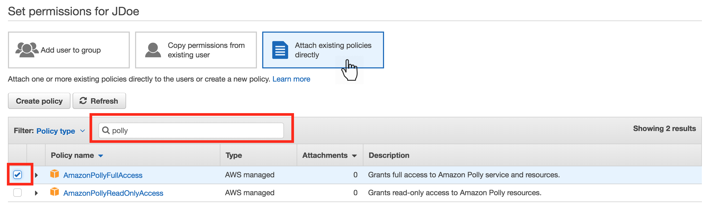

You will be brought to a new screen to review your selections. Here, click, `Create User`.


You'll be brought to a screen letting you know you've successfully created a new User. You will also be given the option to download your credentials. Do this now and make sure you keep it in a secure place. Once you leave this you will no longer be able to retrieve the secret access key. (If you lose your secret access key; however, you can go through this process again and create a new user to get a new key.) Click `Close`.

You're all ready to start using Polly via AWS in R!

### A final note on AWS Access Key Security

You have to make sure amazon web services (AWS) is set up before proceding. To do this, you'll need your AWS keys. Another **warning**: <span style="color:red"> Don't put your credentials in a place where anyone else can find them, especially online. Hackers will [steal them](http://readwrite.com/2014/04/15/amazon-web-services-hack-bitcoin-miners-github/) and, for example, mine cryptocurrency on your dollar. If you accidentally put your credentials in a GitHub repo, [scrub it](https://help.github.com/articles/removing-sensitive-data-from-a-repository/) and [get new AWS keys](http://docs.aws.amazon.com/general/latest/gr/aws-sec-cred-types.html) immediately!</span>

## Google : YouTube API

In order to automatically upload videos to YouTube, you'll need to gain access to the YouTube API:

### Step 1: Google Cloud APIs

Go to [https://console.cloud.google.com/apis](https://console.cloud.google.com/apis) and Cick on `TRY FOR FREE`

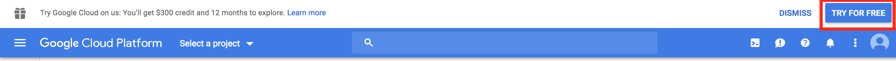

### Step 2: Provide Information

Fill out information -- include your credit card information (auto-billing will *not* occur)


### Step 3: Search APIs

Click on `+ ENABLE APIS AND SERVICES`. Search for "youtube" - click on `YouTube Data API v3`


### Step 4: Enable API

Click `ENABLE`. 

*Note*: This may take a second to load after you click ENABLE.

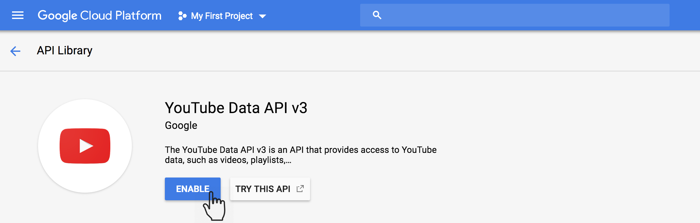

### Step 5: Credentials

You'll be brought to the Dashboard for this API and will see a screen that will let you know you need to create credentials.

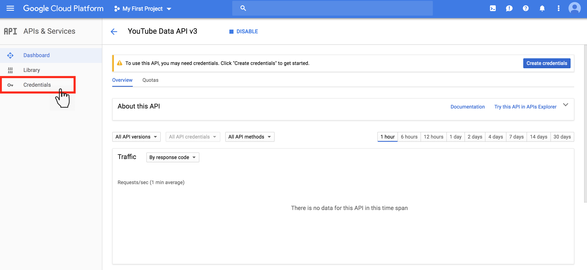

Click on `Credentials` in the menu on the left. This will bring you to a new screen where should click on the arrow to the right of "Create credentials" to expose a drop down menu. On the drop-down menu, click `OAuth client ID`.


You will be brought to a screen letting you know that you have to configure consent. Click on `Configure consent screen`.

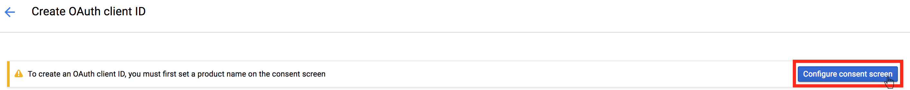

This will open a window where you will select "Other" and give your OAuth client ID a name. Here, I've entered "CBDS." You can do the same. Then click `Create`

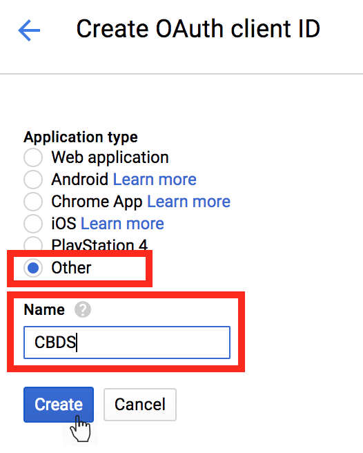

Your OAuth credentials will now be displayed on your screen. Click OK. 

These credentials will now be visible on your credentials screen. To the right of this OAuth key you just created, you should be able to download your credentials. Click on the download arrow. These will download as a JSON file. You can rename this file when you save it locally. You will need to let `didactr` know where this file is later. 

*Note*: **Do not put these on the Internet or on a GitHub repository. Do not make these public.** 

# didactr

You're ready to get started using didactr as long as you have:

1. `ffmeg` installed
2. An AWS account with a User created with permission to use `Polly`
3. Access to the Youtube API

## Install didactr

To get started checking your Leanpub Course, you'll want to install and load the `didactr` package:

```{r install-didactr}
# install.packages("remotes")
# remotes::install_github("muschellij2/didactr")
library(didactr)
```

## Course Inputs

Specify the course inputs to be used in course checking and generation:

```{r didactr-setup, eval=FALSE}
## Specify the course directory
course_dir = "/Users/shannonellis/Desktop/jhudsl_CDS/cds_githubbasics"
## The name of your Course 
## This will be used in YouTube Video Creation
Course = "Version Control"
## Point to where your YouTube API JSON file is saved
json_file = "/Users/shannonellis/Desktop/jhudsl_CDS/yt_Ellis.json"
```

## Check Structure: `check_structure()`

This function checks to see if the expected directories are present within your course directory. The default usage of this function is `check_structure(course_dir = ".")`. 

```{r check-structure, eval=FALSE}
paths<-check_structure(course_dir = course_dir)
```

If expected directories are missing, this function will create them and print a message letting you know it has done so.

## Check Course: `check_course()`

This function looks at the manuscript, script, videos, and images within your course directory and  creates a data frame full of information about your course.

You will be prompted in a web broswer via the `googledrive` package to authenticate your Google account. To check the course, you will need to "Allow" check_course to access your Google Drive. 

```{r check-course, eval=FALSE}
out <- check_course(course_dir = course_dir)
```

Note: over time if you get an error that `object 'mod_time_gs' not found`, this is because your Google Drive authentication is too old. Best to restart R and start again (which will prompt you to re-authenticate). 

### The output

The output from check_course includes a number of objects:

* `course_summary` - the data frame mentioned above. This includes all the necessary metrics for the lessonsin the course. **This is often the only object you'll be interested in.**
* `images` - The path to each image referenced in each lesson ; helpful for troubleshooting
* `image_links` - The text accompanying each image within each lesson ; helpful for troubleshooting
* `bad_img_dir` - logical informing you if an image directory does not exist
* `course_dir` - The course directory input to `check_course()`
* `paths` - paths to directories to be passed through in subsequent functions
* `save_metrics` - logical as to whether or not metrics should be saved when check_course is run

### Viewing output from the course

```{r out, eval=FALSE}
View(out$course_summary)
```

## Create Images: `create_images()`

Once you have the output from check_course (here, that's the object `out`), that will be the input for the rest of the `didactr` functions.

`create_images` will download the PNGs and the PDF from Google Slides directly for any lesson where:

* the Google Slides have been modified more recently than the PNGs were downloaded
* if there is no PDF in the images directory

A message will be printed for any lessons whose images are being generated (or re-generated).

This function will also re-run `check_course()` to update the course data frame.

```{r create-images, eval=FALSE}
out <- create_images(out)
```

## Create Videos: `create_videos()`

`create_videos` will attempt to generate new videos using `ari` for:

* any lesson that does not have a video
* any lesson whose Google Slides have been updated more recently than the video has been generated

This function will also re-run `check_course()` to update the course data frame.

```{r create-videos, eval=FALSE}
#if you have saved your AWS credentials in a .aws/credentials directory
aws.signature::use_credentials(profile="polly")

# otherwise: specify them directly as you see below
# note: these are not actual Keys
# Set up your keys and your region here.
Sys.setenv("AWS_ACCESS_KEY_ID" = "EA6TDV7ASDE9TL2WI6RJ",
           "AWS_SECRET_ACCESS_KEY" = "OSnwITbMzcAwvHfYDEmk10khb3g82j04Wj8Va4AA",
           "AWS_DEFAULT_REGION" = "us-east-2")

out <- create_videos(out)
```

## Upload videos to YouTube: `vids_to_youtube()`

To upload the videos to YouTube, you will have to specify where your YouTube API credentials can be found locally. (This is the JSON file we generated earlier in this document). When you run `vids_to_youtube()` you will be prompted in a web browser to authenticate the Gmail and Youtube account to be used for uploading these videos to Youtube.

`vids_to_youtube()` will upload a video to youtube if:

* no video for the lesson is included in the `youtube_uploads.rda` obeject
* the `ari` video locally was created more recently than the last youtube_upload for that lesson

```{r vids_to_youtube, eval=FALSE}
out <- vids_to_youtube(out, Course=Course, json = json_file)
```

Note: if you're getting an upload error, you may have to run: `file.remove('.httr-oauth')` to remove stale authentication. You will then have to re-authenticate your YouTube account.

This function will also re-run `check_course()` to update the course data frame.

### YouTube Uploads

If you want to take a look at the YouTube uploads file, it is store in the metrics directory and can be looked at using the following:

```{r youtube_uploads, eval=FALSE}
youtube_uploads<-readRDS(file.path(paths$met_path,"youtube_uploads.rds"))
View(youtube_uploads)
```

## Update YouTube URL in lesson: `update_youtube_link()`

Finally, once YouTube videos have been uploaded to YouTube, you'll want to be sure to update the link included at the end of the lesson to this YouTube video. To do so you'll use `update_youtube_link()`. 

`update_youtube_link()` will update the link included in the lesson: 

* if no link to a YouTube video has been included
* if a more recent video has been uploaded to YouTube than the link included

```{r update_youtube_link, eval=FALSE}
out <- update_youtube_link(out)
```

This function will also re-run `check_course()` to update the course data frame.

